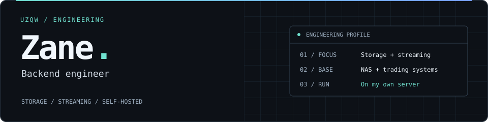

Backend engineer with **2 years on NAS / filesystems** and experience building **trading systems**. Currently focused on **storage and streaming**. The self-hosted tools below are what I run daily — not the main story.

## 01 / Now

- Learning **Apache Iggy** in public — persistence & connectors. PRs will land here when they exist.
- Background: local disks, crash recovery, file semantics — the NAS years.

## 02 / I actually use

| Project | What it does | Deployment / access | In use | Maintained since |
| :--- | :--- | :--- | :--- | :--- |
| [**utips**](https://github.com/uzqw/utips) | Personal workspace — notes, todos, reminders. | Self-hosted · one-command Docker setup | **Daily** | Apr 2025 |
| [**ebook**](https://github.com/uzqw/ebook) | Self-hosted PDF / EPUB reading across devices. | Self-hosted · multi-device access | **Weekly** | Apr 2026 |

**Start with utips** — the more mature of the two, refined through daily use.

## 03 / Experiments (not the headline)

- [**vex**](https://github.com/uzqw/vex) — small in-memory vector store in Go (RESP, optional HNSW, snapshots).
- [**vexlake**](https://github.com/uzqw/vexlake) — short-lived Go + Rust experiment (compute/storage split). Parked.
- A few months around **DataFusion** — too mature to contribute meaningfully as an outsider.

Agent runtimes (Maka, Pi, etc.) are daily drivers, not projects I'm trying to own.

## 04 / Activity

